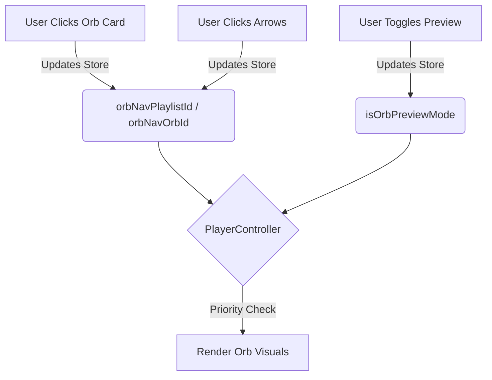

# Orb Navigation System

The Orb Navigation System provides a dedicated interface for browsing Orb configurations directly from the Player Controller, independent of the main video playback flow. This allows users to audition and select different visual styles (Orbs) without interrupting their current content.

## Overview

The system introduces a new navigation layer that operates in parallel to the main video playlist.

-   **Independent State**: Navigation happens within a specific "Orb Context" (`orbNavPlaylistId` and `orbNavOrbId`) stored in `configStore.js`.
-   **Live Preview**: Selecting an Orb instantly applies its visual settings (Image, Scale, Offsets, Spill, Masks) to the central player orb, overriding any default or playlist-based themes.
-   **Smart Filtering**: The navigator automatically filters for playlists that actually contain Orbs, skipping empty ones.

## User Interface

The controls are located on the main **Player Controller** (the central orb area). They appear on hover for a clean look.

### Controls

1.  **Playlist Navigation (Outer Arrows)**
    *   **Icon**: Double Chevron (`ChevronsLeft`, `ChevronsRight`)
    *   **Location**: Far left and far right of the orb.
    *   **Action**: Cycles through *Assignments-only* playlists. When a new playlist is selected, it automatically selects the first Orb in that playlist to give immediate feedback.

2.  **Orb Navigation (Inner Arrows)**
    *   **Icon**: Single Chevron (`ChevronLeft`, `ChevronRight`)
    *   **Location**: Closer to the orb, inside the playlist controls.
    *   **Action**: Cycles through the Orbs within the *currently selected navigation playlist*.

3.  **Direct Selection (Videos Page)**
    *   **Action**: Clicking any **Orb Card** in the main Videos grid will:
        1.  Apply that Orb's visual settings.
        2.  Update the **Orb Navigation State** to match that Orb's playlist and ID.
        3.  This ensures that if you start navigating with the arrows afterward, you continue from that specific Orb.

4.  **Live Preview Toggle (Configuration Page)**
    *   **Icon**: Eye Icon (`Eye`)
    *   **Location**: Top-right of the **Orb Config** page.
    *   **Action**: Forces the player to render the *current configuration being edited*, verifying exactly how it will look before saving.
    *   **Auto-Disable**: This mode automatically turns off when you leave the config page.

## Technical Implementation

### State Management (`configStore.js`)

The system relies on three key pieces of state in the global store:

```javascript
// Global Orb Navigation State
orbNavPlaylistId: null,      // The playlist currently being browsed for Orbs
setOrbNavPlaylistId: (val),

orbNavOrbId: null,           // The specific Orb currently selected
setOrbNavOrbId: (val),

isOrbPreviewMode: false,     // "Live Preview" toggle from the config page
setIsOrbPreviewMode: (val)
```

### Player Controller Logic (`PlayerController.jsx`)

The `getEffectiveOrbImage` function determines what to render based on priority:

1.  **Live Preview Mode**: (Highest Priority) If `isOrbPreviewMode` is true, render the raw configuration values from the store.
2.  **Navigation Override**: If `orbNavOrbId` is set, find that Orb in `orbFavorites` and render it.
3.  **Playlist/Group Theme**: (Default) If no override is active, fall back to the standard playlist theme or group leader logic.

### Data Flow



## Related Components

-   `src/components/PlayerController.jsx`: Main UI and logic.
-   `src/store/configStore.js`: State persistence.
-   `src/components/VideosPage.jsx`: Direct selection from grid.
-   `src/components/OrbCard.jsx`: Visual representation in grid.
